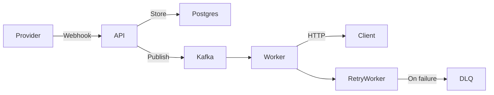
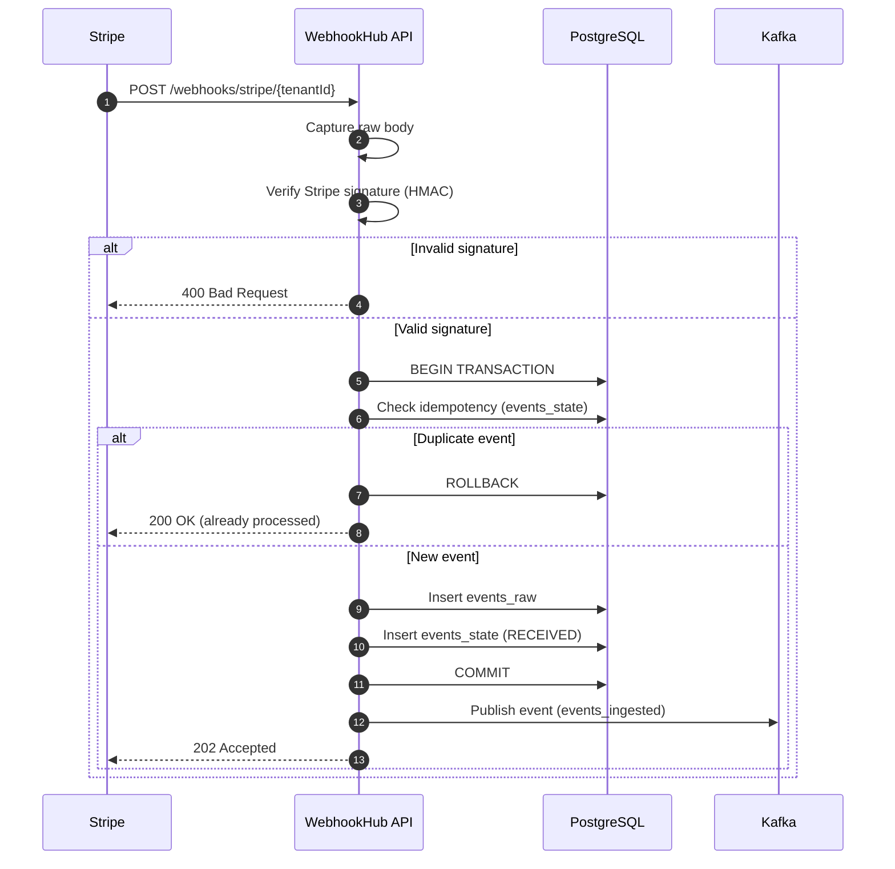
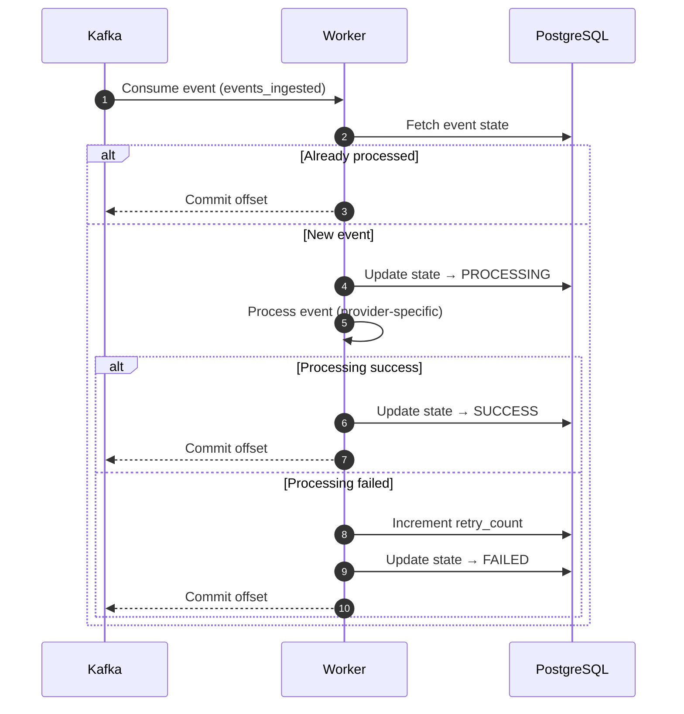
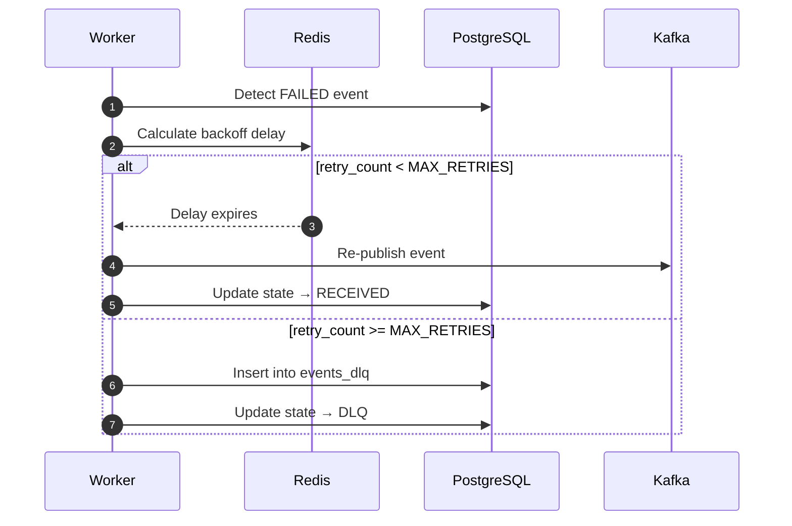
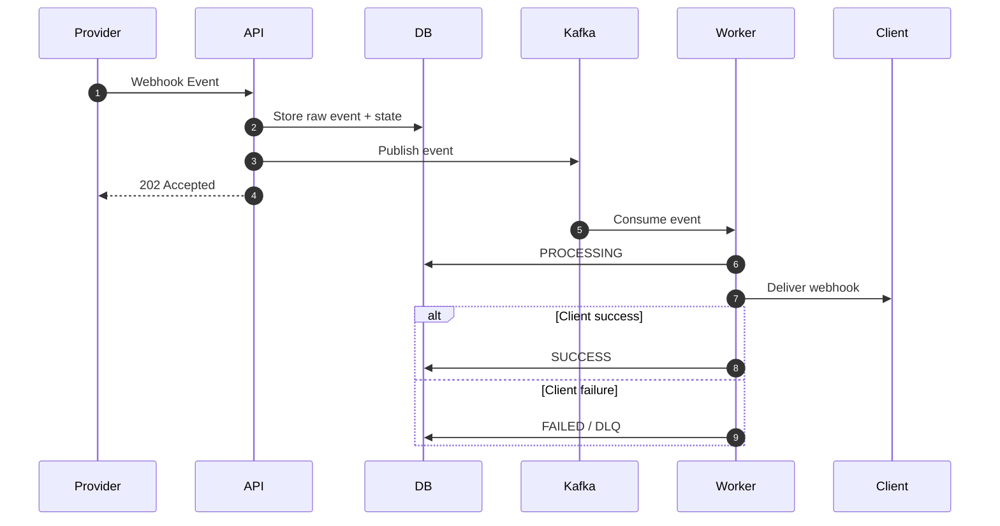
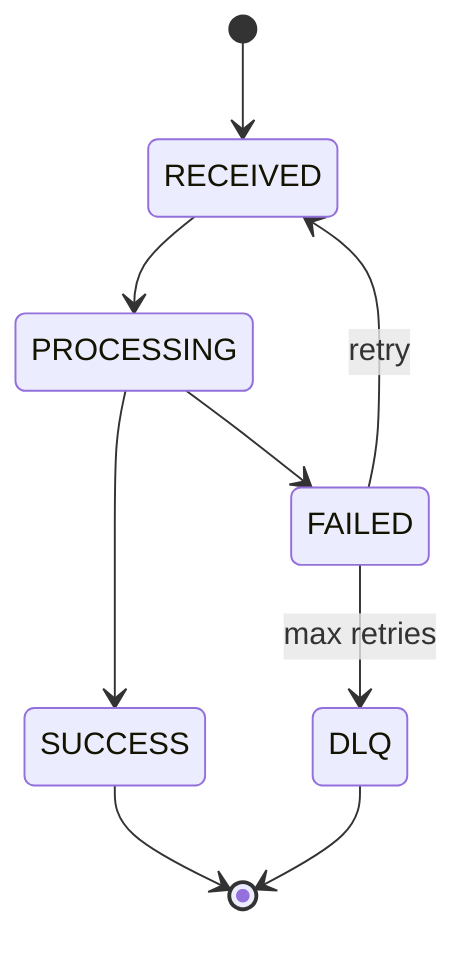

# WebhookHub 🚀

**Production-grade Webhook Ingestion, Delivery & Retry Platform**

WebhookHub is a **multi-tenant, reliable webhook infrastructure** inspired by Stripe, GitHub, and Slack webhook systems.
It provides **safe ingestion**, **fan-out delivery**, **per-subscription retries**, and **dead-letter handling** for event-driven integrations.

---

## 📌 Why WebhookHub?

Building webhooks correctly is hard. Common issues include:

* Duplicate webhook events
* No idempotency guarantees
* Retry storms
* Partial delivery failures
* Lack of observability
* No DLQ or replay mechanism

WebhookHub solves these problems by offering a **robust, scalable, and fault-tolerant webhook system** suitable for SaaS products.

---

## ✨ Key Features

* Multi-tenant webhook ingestion
* Provider signature verification (Stripe-style)
* Idempotent event ingestion
* Kafka-based event fan-out
* Per-subscription delivery tracking
* Exponential retry with backoff
* Dead Letter Queue (DLQ)
* Horizontal worker scalability
* Fully Dockerized local setup

---

### 🌳 Repository Branching Strategy

WebhookHub follows a trunk-based, environment-aligned branching strategy designed for fast iteration, safe deployments, and clear ownership as the system scales.

📌 Branch Overview
* main        → Production-ready code
* develop     → Active development, integration & testing
* feature/*   → New features or improvements
* fix/*       → Bug fixes
* hotfix/*    → Critical production fixes

---

## 🧱 System Architecture

### High-Level Architecture



### Webhook Ingestion Flow (Stripe → WebhookHub API)



### Kafka → Worker Processing Flow


### Retry & DLQ Flow


### End-to-End WebhookHub System Diagram


### Event State Machine


---

## 🧰 Tech Stack

| Layer            | Technology                   |
| ---------------- | ---------------------------- |
| Backend          | Node.js, TypeScript, Fastify |
| Messaging        | Apache Kafka                 |
| Database         | PostgreSQL                   |
| Retry Scheduling | DB-based backoff             |
| Containerization | Docker, Docker Compose       |
| Logging          | Structured JSON logging      |

---

## 📂 Repository Structure

```txt
webhookhub/
├── docker-compose.yml
├── .env.example
├── README.md
├── Makefile
│
├── api/                        # Ingestion Service (Fastify)
│   ├── Dockerfile
│   ├── package.json
│   ├── tsconfig.json
│   └── src/
│       ├── server.ts           # App bootstrap
│       ├── app.ts              # Fastify instance & plugins
│       │
│       ├── routes/
│       │   ├── index.ts
│       │   └── webhook.routes.ts
│       │
│       ├── modules/
│       │   └── webhook/
│       │       ├── webhook.controller.ts
│       │       ├── webhook.service.ts
│       │       ├── webhook.schema.ts
│       │       ├── webhook.repository.ts
│       │       └── webhook.types.ts
│       │
│       ├── infra/              # Cross-cutting infrastructure
│       │   ├── db.ts
│       │   ├── kafka.ts
│       │   ├── redis.ts
│       │   ├── logger.ts
│       │   ├── tracer.ts
│       │   └── metrics.ts
│       │
│       ├── middlewares/
│       │   ├── rateLimit.ts
│       │   ├── signatureVerify.ts
│       │   └── errorHandler.ts
│       │
│       ├── config/
│       │   ├── env.ts
│       │   └── constants.ts
│       │
│       └── utils/
│           ├── hmac.ts
│           ├── idGenerator.ts
│           └── time.ts
│
├── worker/                     # Async Processing Service
│   ├── Dockerfile
│   ├── package.json
│   ├── tsconfig.json
│   └── src/
│       ├── index.ts            # Worker bootstrap
│       │
│       ├── consumers/
│       │   ├── event.consumer.ts
│       │   └── retry.consumer.ts
│       │
│       ├── processors/
│       │   └── stripe.processor.ts
│       │
│       ├── state/
│       │   └── event.state.ts  # State machine logic
│       │
│       ├── infra/
│       │   ├── db.ts
│       │   ├── kafka.ts
│       │   ├── redis.ts
│       │   ├── logger.ts
│       │   └── tracer.ts
│       │
│       ├── services/
│       │   ├── delivery.service.ts
│       │   ├── retry.service.ts
│       │   └── dlq.service.ts
│       │
│       ├── config/
│       │   └── env.ts
│       │
│       └── utils/
│           └── backoff.ts
│
├── infra/                      # Platform Infrastructure
│   ├── prometheus.yml
│   ├── grafana/
│   │   └── dashboards/
│   │       └── webhookhub.json
│   └── nginx/
│       └── nginx.conf
│
├── db/
│   ├── migrations/
│   │   ├── 001_events_raw.sql
│   │   ├── 002_events_state.sql
│   │   └── 003_events_dlq.sql
│   └── seeds/
│       └── tenants.sql
│
├── scripts/
│   ├── create-topics.sh
│   ├── init-db.sh
│   └── replay-event.sh
│
├── tests/
│   ├── unit/
│   │   ├── signature.test.ts
│   │   └── idempotency.test.ts
│   └── integration/
│       └── webhook-flow.test.ts
│
└── docs/
    ├── architecture.md
    ├── api-contracts.md
    └── failure-scenarios.md

```

---

## 🗄️ Data Model Overview

### Core Tables

| Table                   | Purpose                            |
| ----------------------- | ---------------------------------- |
| `tenants`               | SaaS tenants                       |
| `events_raw`            | Immutable webhook ingestion log    |
| `events_state`          | Event lifecycle state              |
| `webhook_subscriptions` | Client webhook endpoints           |
| `event_deliveries`      | Per-subscription delivery tracking |
| `events_dlq`            | Failed events (Dead Letter Queue)  |

For more info explore db-migrate folder of the repo.
---

## 🔁 End-to-End Flow

### 1️⃣ Webhook Ingestion

1. Provider sends webhook
2. Signature is verified
3. Event deduplicated
4. Stored in `events_raw`
5. State initialized in `events_state`
6. Event published to Kafka

---

### 2️⃣ Event Fan-out (Kafka)

* Kafka consumer receives event
* Active subscriptions are fetched
* Delivery records created in `event_deliveries`

---

### 3️⃣ Delivery Execution

* Each subscription is delivered **independently**
* Payload is signed before delivery
* Status updated to `SUCCESS` or `FAILED`

---

### 4️⃣ Retry Handling

* Failed deliveries are scheduled using **exponential backoff**
* Retry metadata stored in DB (`retry_count`, `next_retry_at`)
* Retry worker picks eligible deliveries

---

### 5️⃣ Dead Letter Queue (DLQ)

* Deliveries exceeding max retries are moved to `events_dlq`
* DLQ enables debugging, alerts, and future replay

---

## 🔁 Retry Strategy

WebhookHub uses **exponential backoff**:

```txt
delay = baseDelay * (2 ^ retryCount)
```

Retries are:

* Per-delivery (not per event)
* Bounded by a configurable max retry count
* Safe from retry storms

---

## 🛡️ Idempotency Guarantees

* **Ingestion** is idempotent using `(tenant_id, provider, event_id)`
* **Delivery** is idempotent per `(event_id, subscription_id)`
* Kafka offsets are committed only after safe processing

---

## ⚙️ Local Development Setup

### Prerequisites

* Docker
* Docker Compose

---

### Start All Services

```bash
docker-compose up --build
```

This starts:

* PostgreSQL
* Kafka + Zookeeper
* API service
* Worker service
* Retry worker

---

### Verify Services

| Service  | URL                                            |
| -------- | ---------------------------------------------- |
| API      | [http://localhost:8080](http://localhost:8080) |
| Postgres | localhost:5432                                 |
| Kafka    | localhost:9092                                 |

---

## 🧪 Testing the System

### 1️⃣ Create a Webhook Subscription

```sql
INSERT INTO webhook_subscriptions (
  id, tenant_id, provider, event_type, target_url, secret
)
VALUES (
  gen_random_uuid(),
  'stashfin',
  'stripe',
  'payment.failed',
  'http://localhost:9999/fail',
  'test_secret'
);
```

---

### 2️⃣ Send Test Webhook

```bash
curl -X POST http://localhost:8080/webhooks/stripe/stashfin \
  -H "Content-Type: application/json" \
  -H "Stripe-Signature: test" \
  -d '{
    "id": "evt_test_001",
    "type": "payment.failed",
    "data": { "reason": "card_declined" }
  }'
```

---

### 3️⃣ Observe Behavior

* Event stored in `events_raw`
* Delivery attempts recorded
* Retries scheduled
* DLQ populated after max retries

---

## 💥 Failure Scenarios Covered

* Duplicate webhook events
* Subscriber downtime
* Partial delivery failures
* Retry exhaustion
* Kafka consumer restarts
* Worker crashes

---

## 📈 Scaling & Production Considerations

* Horizontal scaling of workers
* Kafka partitioning
* DB indexes for retry scans
* Observability hooks
* DLQ alerts & replay tooling

---

## 🚀 Future Enhancements

* SaaS dashboard UI
* Client API keys & OAuth
* Webhook replay from DLQ
* Metrics (Prometheus)
* Rate limiting per tenant

---

## 🎯 Engineering Takeaways

WebhookHub demonstrates:

* Event-driven system design
* Safe distributed retries
* Idempotent workflows
* Kafka consumer correctness
* Production-grade failure handling

---

## 👤 Author

Built by **Rituraj Debnath**
Backend Engineer | Distributed Systems | Event-Driven Architecture
